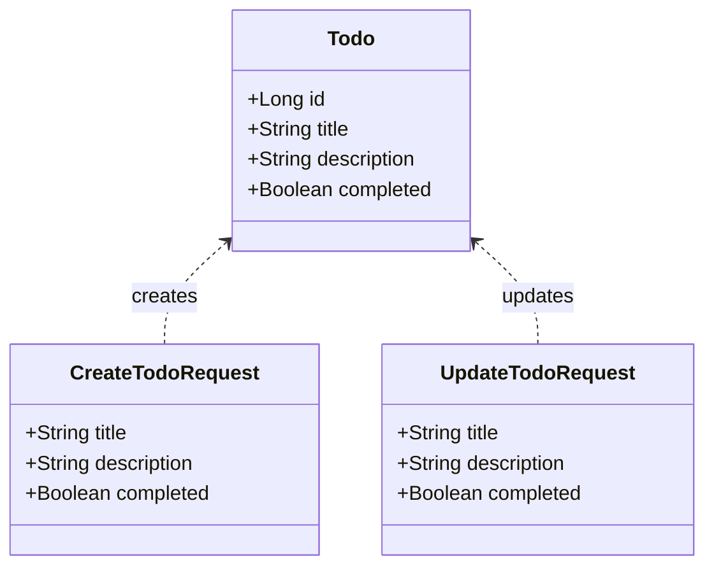

# ToDo Class Diagram

Contains Mermaid class diagram for the ToDo application.  Illustrates the main
classes and their relationships in the ToDo application, including the `Todo` class
and the request/response classes used for API interactions.

